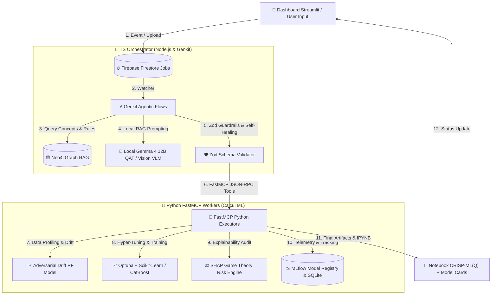
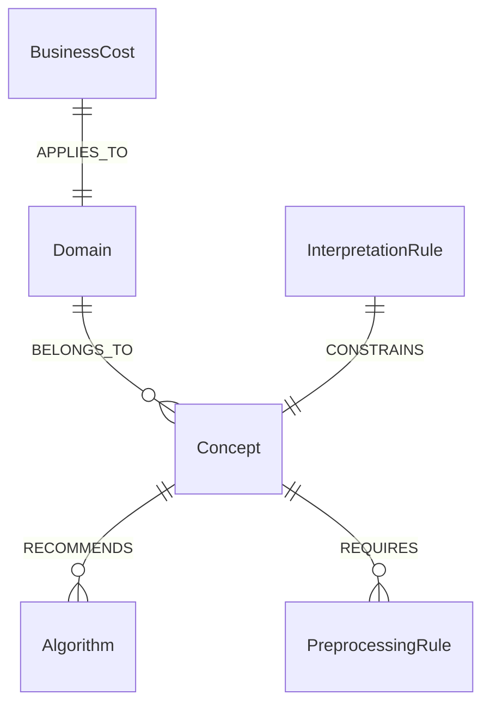

# 🏛️ Architecture Technique & Spécifications — Dataset Automator

Ce document définit l'architecture système, fonctionnelle et logicielle de la plateforme **Dataset Automator**, conçue selon les principes de l'**IA Agentique SOUVERAINE** et des standards industriels **CRISP-ML(Q)**.

---

## 1. 🌟 Principes Fondateurs & Dual-Engine Decoupled Model

`Dataset Automator` repose sur un modèle d'architecture à **découplage asynchrone total** séparant le raisonnement décisionnel high-level (Cerveau) de l'exécution déterministe lourde (Muscles) :



### Decoupled Core Components
1. **Le Cerveau (TS Orchestrator)** :
   - Langage : **TypeScript (Node.js)**
   - Agentic Engine : **Google Genkit**
   - Rôle : Gestion des états de workflow, interrogation du graphe de connaissances Neo4j, découplage d'événements Firestore, boucles d'auto-correction (Self-Healing) et guardrails Zod.
2. **Les Muscles (Python Workers)** :
   - Langage : **Python 3.11**
   - Framework : **FastMCP (Model Context Protocol)**
   - Rôle : Traitement intensif des données Pandas, calculs matriciels, détection d'anomalies, benchmarking Optuna, audit de fuite de données SHAP, et enregistrement MLflow.

---

## 2. 🧠 Graph RAG Ontologique & Base de Connaissances (Neo4j)

L'Orchestrateur TS ne repose pas sur de l'ingénierie de prompt statique. Il interroge dynamiquement un graphe de connaissances **Neo4j** (`bolt://127.0.0.1:7687`) structuré selon une ontologie MLOps stricte :



* **Noeuds `Domain`** : 33 domaines de données et MLOps (Classification, Régression, Clustering, Détection d'Anomalies, Séries Temporelles, NLP, Computer Vision, Analyse de Graphes, Inférence Causale, Apprentissage par Renforcement, Finance & Credit Scoring, Santé, BTP / Génie Civil, E-Commerce, RH, Cybersécurité).
* **Noeuds `Concept` & `PreprocessingRule`** : Formules mathématiques (ex: IMC, Ratios Financiers), règles d'imputation adaptatives (médiane, interpolation, encodage catégoriel), et contrôle de cardinalité.
* **Noeuds `InterpretationRule` & `BusinessCost`** : Seuils de recall minimum, pénalités financières pour faux positifs/faux négatifs, seuils d'overfitting.

---

## 3. 🤖 Souveraineté Edge LLM & Guardrails Multimodaux

### Modèle Local Souverain
* **Moteur principal** : **Google Gemma 4 (12B QAT)** hébergé localement via **LM Studio** (`http://127.0.0.1:1234/v1`).
* **Confidentialité 100% Locale** : Aucun token ni donnée métier n'est envoyé vers des API cloud tierces.
* **Fallback Dynamique** : Interrogation automatique du serveur local via `llm-utils.ts` et `crew_agents.py`.

### Guardrails Double Niveau
1. **Guardrail Mathématique** : Interception automatique des scores AUC, F1-Score et du ratio d'overfitting ($R^2_{\text{train}} - R^2_{\text{test}} > 0.15$).
2. **Guardrail Visuel (VLM Chart Interpreter)** : Inspection par l'Agent de Vision local des matrices de confusion et des résidus (`chart_validator.py`) pour éliminer l'effondrement de classe masqué.

---

## 4. 🔄 Boucle de Résilience "Self-Healing" & Heartbeat System

```
[ Code / JSON Invalide ] ---> [ Interception Zod / Exception Python ]
                                          |
                                          v
                                [ Context Feedback Prompt ]
                                          |
                                          v
                                [ Retry avec Exponential Backoff ] (Max 3)
```

* **Self-Healing Loop** : En cas d'erreur de syntaxe Python dans le notebook généré ou d'incohérence de schéma Zod, l'erreur exacte est réinjectée dans la mémoire du LLM pour auto-correction immédiate dans la sandbox Python.
* **Heartbeat & Process Guard (SIGKILL)** :
  * Les workers Python émettent un signal de vie toutes les **10 secondes** dans Firestore (`lastHeartbeat`).
  * En cas de gel du processus Python (ex: saturation RAM pendant Optuna), l'Orchestrateur applique un `SIGKILL` après 60 secondes et libère les ressources.

---

## 5. 📊 Standard CRISP-ML(Q) & MLOps Telemetry

Chaque execution génère un package complet d'artefacts structurés selon le standard **CRISP-ML(Q)** :

| Phase CRISP-ML(Q) | Composant / Outil | Artefact Produit |
| :--- | :--- | :--- |
| **1. Business & Data Understanding** | `Sweetviz` / `domain_detector.py` | `EDA_Sweetviz_Report.html` |
| **2. Data Preparation & Engineering** | `data_contract.py` / `DataCleaner` | Dataset Nettoyé (`.csv`) |
| **3. Model Building & Hyper-Tuning** | `Optuna` / `Scikit-Learn` / `CatBoost` | Pipelines `.joblib` & `.skops` |
| **4. Evaluation & SHAP Audit** | `SHAP` / `chart_validator.py` | `shap_summary.png` & `MODEL_CARD.md` |
| **5. Deployment & API Generation** | `FastAPI Generator` | `Dockerfile`, `app.py`, `streamlit_app.py` |
| **6. Monitoring & Governance** | `MLflow` & `DataDriftDetector` | `mlflow.db` & Métriques Drift |

---

## 🔒 Sécurité & Conformité
* **Sanitisation PII** : Anonymisation préalable des données nominatives via `piiSanitizer.ts`.
* **Serialization skops** : Utilisation privilégiée du format `skops` au lieu de `pickle` pour se prémunir des vulnérabilités RCE.
