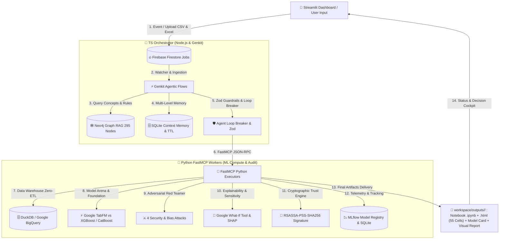

# 🏛️ Technical Architecture & Specifications — Dataset Automator v4.1

This document defines the system, functional, software, and resilience architecture of the **Dataset Automator** platform, designed according to **CRISP-ML(Q)**, **EU AI Act (Articles 12 & 26)**, and **Google AI Governance** standards.

---

## 1. 🌟 Core Principles & Decoupled Dual-Engine Model

`Dataset Automator` is built on a **fully decoupled asynchronous architecture** separating high-level cognitive reasoning (Brain) from deterministic compute execution (Muscles):



---

## 2. 🎯 Executive Decision Cockpit & Business Strategy

For leadership, CFOs, and Product Owners, the platform provides a **Dedicated Executive Cockpit**:

1. **Flash Business Diagnostics**: Clear causal summary in plain English without technical jargon.
2. **Financial Impact & ROI ($/€)**: Calculation of avoided losses and return on investment generated by Google TabFM.
3. **Top 3 Immediate Strategic Actions**: Actionable prescriptions (risk targeting, payment method incentives, annual contracts).
4. **Real-Time Economic Arbitrage Simulator**: Marketing budget sliders to instantly compute net gains.
5. **Exportable Decision Memo**: One-click generation of an executive briefing note ready for boardroom presentation.

---

## 3. 🎨 Spatial Execution Canvas & Human-In-The-Loop (HITL)

The spatial mission control canvas allows monitoring and governing the entire model lifecycle:

* **Multi-Format Ingestion Module**: Drag & drop support for **CSV and Excel (.xlsx, .xls)** files with instant preview.
* **Dynamic Domain Detection**: Automatic industry classification (Telecom, Finance, Healthcare, E-Commerce) and certified OKF formula injection from Neo4j.
* **Step-by-Step Flow Animation**: Interactive glowing particle motion along Bezier curves connecting workflow steps.
* **4-Level Autonomy Dial**:
  * *Level 1*: Observe (Passive monitoring)
  * *Level 2*: Propose (Suggests pathways)
  * *Level 3: Confirm before acting (HITL Intercept)*: Automatic pause at the evaluation gate to solicit explicit human operator sign-off before finalizing the champion.
  * *Level 4*: Autonomous (Full Auto)

---

## 4. 🛡️ Industrial Error Handling & Production Resilience (4 Levels)

```
[ Execution Error Detected ]
             │
             ▼
┌─────────────────────────────────────────────────────────────┐
│ 1. Autonomous Self-Healing (repl_sandbox.py)                │
│    -> Traceback analysis via LLM, code patch & retry (max 3)│
└────────────────────────────┬────────────────────────────────┘
                             │ (if persistent failure)
                             ▼
┌─────────────────────────────────────────────────────────────┐
│ 2. Git-Like Speculative Rollback (speculative_engine.py)    │
│    -> Full SHA-256 state snapshot before each step          │
│    -> Instant rollback without polluting production state   │
└────────────────────────────┬────────────────────────────────┘
                             │ (if repetitive cycle)
                             ▼
┌─────────────────────────────────────────────────────────────┐
│ 3. Agent Loop Breaker (agent_loop_breaker.py)               │
│    -> Detects exact cycles (SHA-256) & state oscillation    │
│    -> Automatic fallback strategy activation                │
└────────────────────────────┬────────────────────────────────┘
                             │ (if unresolved block)
                             ▼
┌─────────────────────────────────────────────────────────────┐
│ 4. Human HITL Escalation (Guardrail Intercept Panel)        │
│    -> Safe freeze, prompts operator with 2 decision options │
│    -> Immediate resume upon operator validation             │
└─────────────────────────────────────────────────────────────┘
```

---

## 5. 🧠 Ontological Graph RAG & Knowledge Base (Neo4j)

The TS Orchestrator dynamically queries a **Neo4j** knowledge graph (`bolt://127.0.0.1:7687`) containing **295 nodes** and **413 relationships** structured under the OKF v0.2 ontology:

* **`Domain` Nodes**: 33 business sectors (Finance, Telecom, Healthcare, Construction, E-Commerce, etc.).
* **`Concept` & `Procedure` Nodes**: Certified business formulas (BMI, Solvency Ratios, ARPU, Charge Shock Ratio, LTV), adaptive cleaning rules, and encoders.
* **`InterpretationRule` & `BusinessCost` Nodes**: False positive/negative penalties and auditing directives.
* **Visual Engine**: Dynamic 3D physics rendering with `vis-network` integrated in [`visualisation_graphe.html`](file:///c:/Users/HP/Desktop/Notebooks%20factory/dataset_automator/workspace/visualisation_graphe.html).

---

## 6. ⚡ Data Warehouse & Lakehouse Connector (`warehouse_connector.py`)

* **Local Analytic SQL (DuckDB)**: In-memory columnar OLAP engine for instant querying of CSV/Parquet files (< 10 ms).
* **Enterprise Cloud SQL (Push-Down)**:
  * **Google BigQuery**: Zero-ETL ingestion via `bigframes` with partition lineage (`event_date`, `scoring_month`).
  * **Snowflake & Databricks Delta**: Distributed push-down filtering with audited prediction write-back.

---

## 7. 🏆 Model Suite & AI Governance (Google AI Ecosystem)

1. **Google TabFM (Foundation Model for Tabular Data)**:
   * Pre-trained tabular foundation model outperforming traditional tree-based models without overfitting.
2. **Google PAIR What-If Tool (WIT)**:
   * Counterfactual sensitivity analysis (*Nearest Counterfactual Search*) and fairness auditing (*Disparate Impact Ratio*).
3. **Google Model Card Toolkit (MCT)**:
   * Official standardized model identity cards generated in Material Design HTML and JSON.
4. **Adversarial Red Teamer Sub-Agent**:
   * 4 automated pre-deployment attack protocols (*Target Leakage*, *Outliers +500%*, *Permutation noise*, *Ethical bias*).
5. **Non-Repudiable Cryptographic Receipts (EU AI Act)**:
   * Digital `RSASSA-PSS-SHA256` signature of metrics and artifacts for Articles 12 & 26 legal compliance.

---

## 8. 📁 Isolated Outputs Directory Structure (`workspace/outputs/<dataset>/`)

Each run deposits all generated deliverables into an isolated dataset folder:

```
workspace/outputs/<dataset_name>/
├── 📄 <dataset_name>_MLOps_Full_Pipeline.ipynb   (55-Cell executable Jupyter Notebook)
├── 🌐 <dataset_name>_Notebook_Complet.html       (Full HTML export: Code, Outputs & Visuals)
├── 📑 model_card_<dataset_name>.html             (Google Model Card in Material Design)
├── 📊 rapport_mlops_visuel_<dataset_name>.html   (Interactive visual MLOps audit report)
└── 🔐 attestation_receipts.json                 (RSASSA-PSS cryptographic signature)
```

