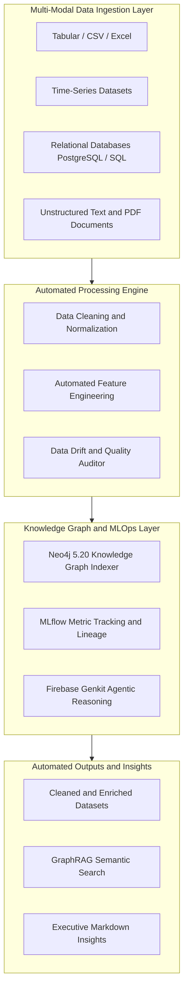

# 🤖 Dataset Automator — Universal MLOps, Multi-Modal Data Engineering & Agentic RAG Pipeline

> **Dataset Automator** is an end-to-end, multi-modal MLOps platform engineered for automated dataset preprocessing, knowledge graph semantic indexing, experiment tracking, and agentic decision intelligence. Created & maintained by **KOA MARIE GERVAIS NELLY** (`@gervais-afk`).

---

## 🌟 Comprehensive Platform Architecture & Data Flow

---

## 🚀 Key Capabilities & Modules

1. **📥 Universal Multi-Modal Ingestion**: Handles tabular data, time-series, relational SQL schemas, unstructured text documents, and domain-specific BTP datasets seamlessly.
2. **🧹 Automated Data Hygiene & Quality Audit**: Automatically identifies missing values, out-of-range anomalies, structural inconsistencies, and data drift.
3. **🕸️ Neo4j 5.20 Knowledge Graph Indexer**: Constructs semantic relationships between entities, attributes, and data dependencies for high-precision GraphRAG.
4. **📊 MLflow Tracking & Lineage**: Full reproducibility tracking for dataset versions, model metrics, parameter tuning, and execution graphs.
5. **🤖 Agentic Insight Generation (Genkit + Gemma/Gemini)**: Multi-agent execution traces delivering natural language data summaries, SQL generation, and automated report synthesis.

---

## 💻 Tech Stack & Repository Structure

- **`ts-orchestrator/`**: TypeScript multi-agent orchestrator powered by **Firebase Genkit**.
- **`py-executors/`**: Python 3.11 data engineering pipelines, feature engineering, and cleaning algorithms.
- **`mcp-neo4j-server/`**: Neo4j 5.20 Cypher query engine and GraphRAG knowledge graph generator.
- **`scripts/`**: Automated seeding and cost enrichment scripts.

---

## 👨‍💻 Author & Intellectual Property

* **Author & Lead Engineer**: **KOA MARIE GERVAIS NELLY** ([@gervais-afk](https://github.com/gervais-afk))
* **Education**: MSc. in Artificial Intelligence & Data Science (University of Ngaoundéré) & B.Sc. in Civil Engineering (ISTDI / IUC Douala).
* **Flagship Project**: Founder of **[Archi Cam AI](https://github.com/gervais-afk/archi-cam-ai)**.

---

## 📄 License

Proprietary License — All Rights Reserved.  
Copyright (c) 2026 **KOA MARIE GERVAIS NELLY (@gervais-afk)**. All rights reserved.
