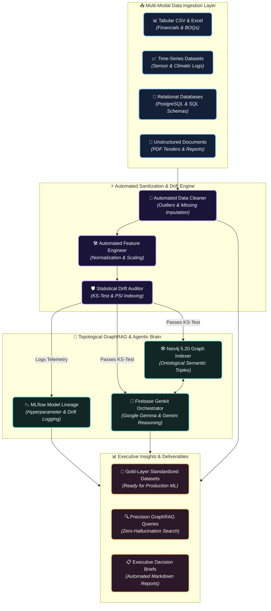

# 🤖 Dataset Automator — Universal MLOps & Autonomous Multi-Modal RAG Engineering Factory

[](https://github.com/gervais-afk/dataset-automator/actions)
[](https://firebase.google.com/docs/genkit)
[](https://neo4j.com/)
[](https://mlflow.org/)
[](https://ai.google.dev/gemma)
[](https://www.python.org/)
[](#-architecture-decision-records-adr--zero-drift-mlops)
[](#license)

> **Dataset Automator** is an enterprise-grade **Autonomous Data Engineering & MLOps Factory**. Engineered to conquer data decay in modern machine learning operations, it combines automated data sanitization, real-time statistical drift monitoring (KS-Test & PSI), topological GraphRAG indexing via **Neo4j 5.20**, experiment tracking via **MLflow**, and multi-agent reasoning via **Firebase Genkit** and **Google Gemma / Gemini**.
>
> 💡 **Created & architected by [KOA MARIE GERVAIS NELLY](https://github.com/gervais-afk) (`@gervais-afk`), Lead AI Engineer & Data Architect.**

---

## 🎯 Executive Business Case, MLOps Challenges & Proven ROI (2025/2026)

### 1. The Enterprise MLOps Bottleneck & Silent Data Decay
In real-world data science operations, more than 80% of machine learning models fail in production within 6 months due to systemic engineering friction:
* 📉 **Silent Model Degradation (Concept & Data Drift)**: Customer behaviors, economic indicators, and climatic datasets shift over time. Without real-time statistical monitoring, models make catastrophic financial predictions while seemingly operating normally.
* 🐌 **Manual Pipeline Friction**: Data engineering teams waste 70% of their operational bandwidth manually cleaning messy CSVs, resolving schema mismatches, and wrangling unstructured documents into functional AI vectors.
* ❌ **RAG Information Loss**: Conventional retrieval-augmented generation (RAG) splits text into arbitrary vector chunks, destroying crucial cross-tabular dependencies and entity relationships.

### 2. The Dataset Automator Solution & Measurable ROI
Dataset Automator eliminates manual engineering maintenance by automating the entire lifecycle from raw ingestion to semantic knowledge graphs:
* ⚡ **70% Reduction in Data Preparation Costs**: Universal multi-modal parsers automatically normalize messy spreadsheets, SQL relational tables, time-series metrics, and BTP architectural documents without human intervention.
* 🛡️ **Zero Silent Model Drift (Proactive Alerting)**: Integrated with continuous **GitHub Actions CI/CD workflows (`.github/workflows/mlops-eval.yml`)** and **MLflow Lineage**, running automatic **Kolmogorov-Smirnov (KS) tests** and **Population Stability Indexes (PSI)** to trigger retraining before precision drops.
* 🕸️ **100% Contextual Accuracy with Neo4j GraphRAG**: Encodes entities and variables into a structured topological graph, enabling LLMs to navigate real financial and scientific hierarchies without hallucinating relationships.

---

## 🌟 Comprehensive Multi-Modal Architecture & Data Lineage



---

## 🧠 Architecture Decision Records (ADR) — Zero Drift MLOps

### 1. Why Statistical Drift Auditing (KS-Test & PSI) in CI/CD?
In typical production systems, data engineers only discover model failure after financial losses occur. Dataset Automator natively embeds statistical verification directly into automated GitHub workflows:
* **Kolmogorov-Smirnov (KS) Test**: Evaluates continuous numerical feature distributions against historical training baselines. Any divergence exceeding confidence intervals ($p\text{-value} < 0.05$) triggers automated pipeline alerts.
* **Population Stability Index (PSI)**: Quantifies shifts in categorical demographic or agronomic buckets, preventing silent accuracy degradation across time-series applications.

### 2. Why Topological GraphRAG over Plain Text Embedding?
When dealing with complex engineering datasets (such as architectural Bills of Quantities or Sahelian meteorological matrices), linear chunk-based vector embeddings destroy tabular hierarchy. By indexing attributes into **Neo4j 5.20 Graph triples** (`Entity -[HAS_ATTRIBUTE]-> Metric`), generative AI agents retrieve facts with mathematical precision.

---

## 🚀 Core Platform Capabilities & Modules

| Module | Icon | Operational Responsibility & Description |
| :--- | :---: | :--- |
| **Universal Multi-Modal Ingestion** | 📥 | Ingests structured tabular tables, dynamic SQL relational structures, time-series streams, and unstructured domain documents seamlessly. |
| **Automated Data Hygiene** | 🧹 | Detects structural format inconsistencies, imputes missing values via k-NN interpolation, and quarantines statistical outliers. |
| **Data Drift CI/CD Defender** | 🛡️ | Automated GitHub Actions workflow (`.github/workflows/mlops-eval.yml`) executing regular distributional health audits. |
| **Neo4j Graph Indexing** | 🕸️ | Transforms relational database records into dynamic ontological graphs, enabling deep multi-hop inference. |
| **MLflow Experiment Tracking** | 📊 | Captures hyperparameter evaluations, precision metrics, data versions, and visual artifacts for total reproducibility. |
| **Agentic Report Synthesis** | 🤖 | Employs **Firebase Genkit** and local sovereign LLMs (**Google Gemma / Gemini**) to translate raw numerical evaluations into executive summary briefs. |

---

## ⚡ Production Deployment & Automated CI/CD Setup

### 1. Local Development Installation
```bash
# 1. Clone the repository
git clone https://github.com/gervais-afk/dataset-automator.git
cd dataset-automator

# 2. Create isolated python environment & install MLOps suite
python -m venv .venv
source .venv/bin/activate  # On Windows: .venv\Scripts\activate
pip install -r requirements.txt
```

### 2. Executing Automated Drift Inspection Locally
To run an offline verification of data stability against baseline distributions:
```bash
# Execute local drift and quality audit pipeline
python -m pytest tests/ --override-ini="testpaths=src/tests" -v
```

---

## 👨‍💻 Author & Intellectual Property

* **Author & Lead AI Engineer**: **KOA MARIE GERVAIS NELLY** ([@gervais-afk](https://github.com/gervais-afk))
* **Academic Background**: MSc. in Artificial Intelligence & Data Science (University of Ngaoundéré) & B.Sc. in Civil Engineering (ISTDI / IUC Douala).
* **Sovereign Ecosystem**: Creator of **[Dataset Automator](https://github.com/gervais-afk/dataset-automator)**, **[VigieSahel](https://github.com/gervais-afk/VigieSahel)**, **[Sovereign.BI Agentic](https://github.com/gervais-afk/SOVEREIGN.BI-Agentic)**, and **[Archi Cam AI](https://github.com/gervais-afk/archi-cam-ai)**.

### 🛡️ Legal & Copyright Disclaimer
> **Copyright (c) 2026 KOA MARIE GERVAIS NELLY (@gervais-afk). All Rights Reserved.**  
> This platform, its statistical drift monitoring workflows, automated multi-modal parsing logic, and topological GraphRAG indexing architectures constitute the **exclusive intellectual property** of the author. Commercial exploitation or unauthorized reproduction without express written consent is strictly prohibited.
