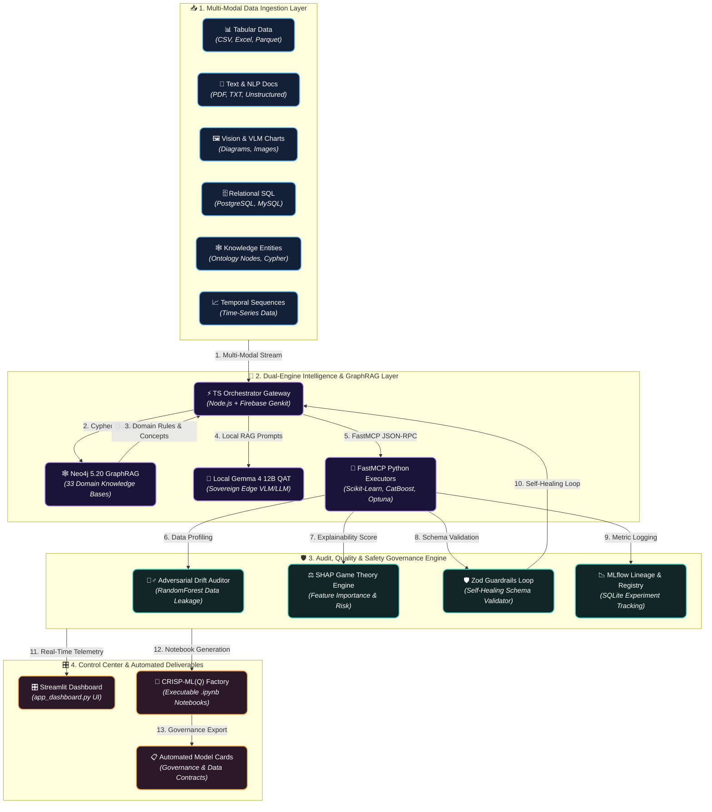

# 🤖 Dataset Automator — Universal Multi-Modal MLOps, Multi-Domain Data Engineering & Agentic RAG Platform

[](https://firebase.google.com/docs/genkit)
[](https://neo4j.com/)
[](https://mlflow.org/)
[](https://ai.google.dev/gemma)
[](https://www.python.org/)
[](#license)

> **Dataset Automator** is an end-to-end, **Universal Multi-Modal & Multi-Domain MLOps Platform** engineered for automated data engineering, 33-domain MLOps knowledge indexing, experiment tracking, adversarial drift detection, and agentic decision intelligence. Created & maintained by **KOA MARIE GERVAIS NELLY** (`@gervais-afk`).

---

## 🌟 Universal Multi-Modal Platform Architecture & Data Flow



---

## 🚀 33 Integrated Knowledge & MLOps Domains

Dataset Automator embeds a comprehensive knowledge ontology across **33 specialized data science & industry domains**:

| Category | Supported Domains & Capabilities |
| :--- | :--- |
| **Supervised ML** | Classification, Regression, XGBoost, CatBoost, LightGBM, Random Forest, Feature Engineering |
| **Unsupervised ML** | Clustering (K-Means, DBSCAN, Hierarchical), Dimensionality Reduction (PCA, UMAP, t-SNE), Association Rules |
| **Advanced Analytics** | Anomaly & Outlier Detection, Survival Analysis, Causal Inference, A/B Testing, Optimization |
| **Multi-Modal AI** | Natural Language Processing (NLP), Computer Vision & VLM Chart Interpretation, Time-Series Forecasting |
| **Advanced Paradigms** | Graph Analysis & Network Science, Reinforcement Learning, Semi-Supervised Learning, Recommendation Engines |
| **Vertical Industry Knowledge** | Finance & Credit Scoring, Healthcare & Medical, BTP / Civil Engineering, E-Commerce, HR Analytics, Meteorology |
| **MLOps & Governance** | Data Cleaning, Data Validation, Data Engineering, Orchestration, Modeling, Development Tools, Validation |

---

## ⚙️ Key Core Modules

1. **🧠 Dual-Engine Decoupled Architecture**: High-level reasoning powered by **TypeScript + Firebase Genkit**, paired with deterministic high-performance computing powered by **Python 3.11 FastMCP Workers**.
2. **🕸️ Neo4j 5.20 GraphRAG Engine**: Semantic knowledge graph linking concepts, business cost rules, data quality metrics, and model choice heuristics.
3. **🕵️‍♂️ Adversarial Quality & SHAP Risk Engine**: Automatic detection of data leakage, target drift, distribution shifts, and feature importance explainability via SHAP.
4. **🛡️ Zod Guardrails & Self-Healing**: Automated feedback loops for prompt self-healing and output schema validation.
5. **🎛️ Interactive Streamlit Control Center**: Real-time pipeline execution, dataset inspection, metric visualization, and interactive GraphRAG search in `app_dashboard.py`.
6. **📄 Automated CRISP-ML(Q) Notebook Factory**: Produces complete, execution-ready Jupyter notebooks (`.ipynb`), data contracts, and standardized model cards.

---

## 💻 Tech Stack & Repository Structure

- **`ts-orchestrator/`**: TypeScript multi-agent orchestrator built on **Firebase Genkit**.
- **`py-executors/`**: Python 3.11 FastMCP workers, ML pipeline algorithms, notebook factory, and Streamlit UI.
- **`mcp-neo4j-server/`**: Neo4j 5.20 Cypher query engine and GraphRAG knowledge indexer.
- **`knowledge_base/`**: 33 domain specification markdowns, heuristics, and concept definitions.
- **`workspace/`**: MLflow SQLite registry (`mlflow.db`), artifacts, outputs, and generated notebooks.

---

## ⚡ Quickstart & Ports Overview

```bash
# 1-Click System Launcher (Launches all background services)
.\launch_all.bat
```

| Service | Port | Description |
| :--- | :--- | :--- |
| **Streamlit Control Center** | `8501` | Interactive Dashboard UI (`app_dashboard.py`) |
| **Neo4j Graph Database** | `7687` | Cypher Bolt Endpoint & GraphRAG Browser (`7474`) |
| **FastMCP Python Executors** | `8000` | FastMCP Tool Server for ML execution |
| **TS Orchestrator Gateway** | `3001` | Node.js / Genkit Agentic Router |
| **MLflow Experiment Server** | `5000` | MLflow Tracking UI & Lineage |

---

## 👨‍💻 Author & Intellectual Property

* **Author & Lead Engineer**: **KOA MARIE GERVAIS NELLY** ([@gervais-afk](https://github.com/gervais-afk))
* **Education**: MSc. in Artificial Intelligence & Data Science (University of Ngaoundéré) & B.Sc. in Civil Engineering (ISTDI / IUC Douala).
* **Flagship Platform**: Creator of **Dataset Automator** and **[Archi Cam AI](https://github.com/gervais-afk/archi-cam-ai)**.

---

## 📄 License

Proprietary License — All Rights Reserved.  
Copyright (c) 2026 **KOA MARIE GERVAIS NELLY (@gervais-afk)**. All rights reserved.
