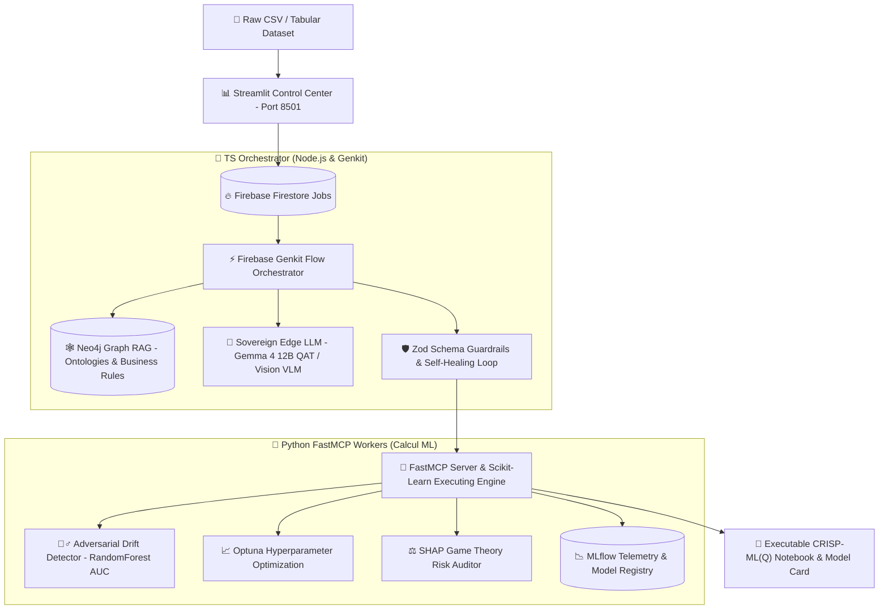

# 🌟 Dataset Automator — Sovereign Agentic MLOps Platform

[](https://www.typescriptlang.org/)
[](https://firebase.google.com/docs/genkit)
[](https://ai.google.dev/gemma)
[](https://www.python.org/)
[](https://modelcontextprotocol.io/)
[](https://mlflow.org/)
[](https://neo4j.com/)
[](https://streamlit.io/)
[](#license)

> **Dataset Automator** est une plateforme industrielle d'**IA Agentique SOUVERAINE appliquée au MLOps (CRISP-ML(Q))**. Elle orchestre de multiples agents intelligents spécialisés pour profiler, nettoyer, optimiser, auditer et documenter n'importe quel jeu de données tabulaires de manière déterministe et sécurisée.

---

## 🏛️ Architecture Globale & Modèle Découplé

`Dataset Automator` allie la puissance du raisonnement génératif (LLM locaux/cloud) avec la rigueur de l'ingénierie logicielle traditionnelle (Bases de graphes Neo4j, validation Zod, Guardrails mathématiques & vision par ordinateur) :



Pour les spécifications d'ingénierie détaillées, consultez notre document d'architecture :
👉 **[ARCHITECTURE.md](file:///c:/Users/HP/cam_data_sov_solutions%20newversion/dataset_automator/ARCHITECTURE.md)**

---

## 🌟 Piliers Fonctionnels & Agents Experts

### 1. 🕵️‍♂️ Agent Adversarial Validator (Détection de Drift & Leakage)
* Séparation chronologique ou stratifiée du dataset en 80% (passé) et 20% (futur).
* Entraînement d'un classifieur (`RandomForest`) pour distinguer le passé du futur.
* Si le score **AUC > 0.6**, un dérive statistique (Drift) est identifiée. L'agent extrait les variables responsables et adapte le plan de nettoyage.

### 2. 🧠 Graph RAG Ontologique Neo4j
* Extraction des règles métiers et formules expertes depuis **Neo4j** (ex: *"Privilégier l'interpolation pour les séries temporelles"* ou calculs de métriques d'affaires).

### 3. 🔄 Self-Healing Loop (Auto-Correction de Code & Schémas)
* Validation stricte par schémas **Zod**. En cas d'erreur de syntaxe ou de sortie LLM hors format, l'erreur est interceptée et réinjectée avec un délai d'attente progressif (backoff exponentiel jusqu'à 3 essais).

### 4. 🚦 Double Guardrail (Mathématique & Visuel VLM)
* **Guardrail Mathématique** : Détection d'overfitting ($R^2_{\text{train}} - R^2_{\text{test}} > 0.15$) et de déséquilibre de classe.
* **Guardrail Visuel (Chart Interpreter)** : Inspection multimodale des matrices de confusion et graphiques par le modèle de vision local.

### 5. ⚖️ Agent Explainability Auditor (SHAP Game Theory Audit)
* Attribution SHAP des variables dans la décision du modèle.
* Détection automatique des proxys biaisés (feature pèsant >80% de la décision).

---

## 💻 Tech Stack Overview

### 🤖 IA Agentique & Orchestration
* **Agentic Framework** : **Firebase Genkit** (`ts-orchestrator/src/`)
* **Sovereign Local LLM** : **Google Gemma 4 (12B QAT)** via LM Studio API
* **Graph RAG Database** : **Neo4j 5.20** (`bolt://127.0.0.1:7687`)

### 🐍 Workers Python & Calcul ML
* **Moteur FastMCP** : Python 3.11, FastMCP, Pandas, Scikit-Learn, CatBoost, Optuna, SHAP.
* **MLOps & Tracking** : **MLflow** (`mlflow.db` SQLite & Model Registry).
* **Interface Utilisateur** : **Streamlit** Control Center (`py-executors/src/app_dashboard.py`).

---

## 📂 Structure du Projet

```ascii
dataset_automator/
├── ARCHITECTURE.md                  # 🏛️ Spécifications d'architecture détaillée
├── README.md                        # 📖 Documentation principale du projet
├── instructions_lancement.md        # 🚀 Guide rapide de démarrage
├── launch_all.bat                   # ⚡ Lanceur automatisé 1-clic des 5 services
├── roadmap.md                       # 🗺️ Feuille de route technique Gemma 4
├── roadmap_futur.md                 # 🔮 Évolutions futures & production
├── .env.example                     # 🔑 Modèle de variables d'environnement
├── LICENSE                          # ⚖️ Licence MIT
│
├── ts-orchestrator/                 # 🧠 Le Cerveau (Genkit & TypeScript)
│   ├── src/
│   │   ├── index.ts                 # Point d'entrée de l'Orchestrateur
│   │   ├── agents/                  # Générateurs de stratégies
│   │   ├── rag/                     # Client Graph RAG Neo4j & OKF Reader
│   │   ├── guardrails/              # Validation Zod & Self-Healing
│   │   └── vision/                  # Interpretation visuelle VLM
│   └── scripts/                     # Outils d'injection de connaissances Cypher
│
├── py-executors/                    # 💪 Les Muscles (FastMCP Python)
│   ├── src/
│   │   ├── server.py                # FastMCP Server & Outils ML
│   │   ├── app_dashboard.py         # Dashboard Streamlit métier
│   │   ├── notebook_factory.py      # Générateur de Notebooks CRISP-ML(Q)
│   │   └── tools/                   # Drift, Data Contracts, SHAP, REPL Sandbox
│   └── templates/notebook_steps/    # 15+ Templates de code ML (TimeSeries, NLP, etc.)
│
├── scripts/neo4j/                   # 🕸️ Scripts Cypher d'ontologie & règles
├── knowledge_base/                  # 📚 Base documentaire par domaine ML
└── workspace/                       # 📄 Dossier de sortie des artefacts & MLflow
```

---

## 🚀 Quickstart & Guide d'Installation Rapide

### Prérequis
* **Node.js** >= 18.x
* **Python** >= 3.11 & **uv** package manager
* **Docker Desktop** (pour le conteneur Neo4j)
* **LM Studio** (pour le modèle local **Google Gemma 4 12B QAT**)

### 1. Cloner le Dépôt
```bash
git clone https://github.com/gervais-afk/dataset-automator.git
cd dataset-automator
```

### 2. Configurer les Variables d'Environnement
```bash
cp .env.example .env
```

### 3. Lancer en 1 Clic (Recommandé)
Double-cliquez sur **`launch_all.bat`** à la racine du dépôt.

Ou via PowerShell :
```powershell
.\launch_all.bat
```

---

## 🌐 Interfaces & Ports Locaux

| Service | Endpoint | Description |
| :--- | :--- | :--- |
| **Streamlit Control Center** | [http://localhost:8501](http://localhost:8501) | Dashboard Web Utilisateur |
| **MLflow UI** | [http://localhost:5000](http://localhost:5000) | Tracking d'expériences & Modèles |
| **Genkit Developer UI** | [http://localhost:4000](http://localhost:4000) | Observabilité & Traces des Agents |
| **Neo4j Web Browser** | [http://localhost:7474](http://localhost:7474) | Visualisation du Graph RAG |
| **LM Studio Local API** | [http://localhost:1234](http://localhost:1234) | Endpoint Souverain Gemma 4 12B QAT |

---

## 👤 Auteur & Contact

* **Nom** : Gervais KOA (`gervais-afk`)
* **Rôle** : Ingénieur IA & LLMOps
* **Contact** : [koagervais85@gmail.com](mailto:koagervais85@gmail.com)
* **GitHub** : [https://github.com/gervais-afk](https://github.com/gervais-afk)

---

## ⚖️ Licence

Ce projet est sous licence [MIT](LICENSE).
