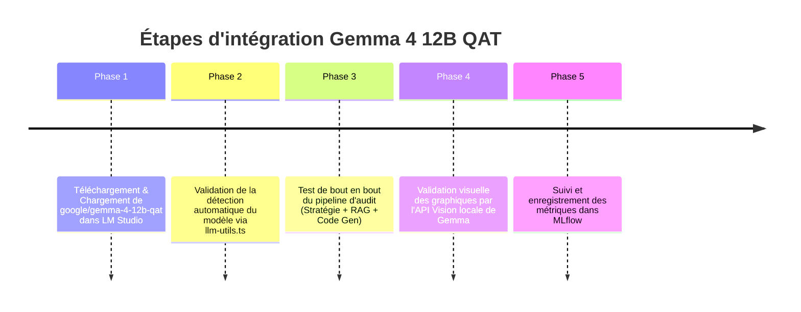

# Feuille de Route : Architecture LLM Unifiée & Auto-Correction de Notebook

Ce document détaille l'évolution du pipeline d'audit de données vers une architecture unifiée basée sur un modèle local souverain multimodal (Gemma 4 12B QAT), ainsi que les modifications requises dans le code pour le supporter.

---

## 1. Répartition Cible des Rôles (Architecture Unifiée)

| Phase du Pipeline | Modèle Recommandé | Rôle & Justification |
| :--- | :--- | :--- |
| **Phase 2 : RAG & Stratégie** | `google/gemma-4-12b-qat` | Comprendre les règles métier Neo4j rédigées en français et structurer le premier plan de nettoyage. |
| **Phases 3 & 4 : Génération & Débogage** | `google/gemma-4-12b-qat` | Écrire et corriger le code Python du notebook. Le modèle possède des capacités de raisonnement avancées pour gérer le débogage et l'utilisation d'outils. |
| **Phase 4.5-bis : Validation Visuelle** | `google/gemma-4-12b-qat` | Inspecter visuellement la matrice de confusion et les graphiques d'évaluation directement en local. |

---

## 2. Modifications Requises dans le Workflow (Code Source)

Grâce à l'utilisation de `google/gemma-4-12b-qat` comme modèle unique et multimodal, l'architecture est grandement simplifiée. Le système interroge dynamiquement l'API locale de LM Studio pour détecter le modèle actif.

### A. Détection Dynamique du Modèle (`llm-utils.ts` & `crew_agents.py`)
Le workflow n'a pas besoin de routage complexe multi-ports. Il appelle l'endpoint `/v1/models` de LM Studio pour utiliser le modèle chargé. Si LM Studio ne répond pas, le système utilise `google/gemma-4-12b-qat` comme fallback par défaut.

*Configuration actuelle dans le code source :*
- **TypeScript (`ts-orchestrator`)** : [llm-utils.ts](file:///c:/Users/HP/cam_data_sov_solutions%20newversion/dataset_automator/ts-orchestrator/src/llm-utils.ts) exporte `getActiveModelName(fallback: string = 'google/gemma-4-12b-qat')`.
- **Python (`py-executors`)** : [crew_agents.py](file:///c:/Users/HP/cam_data_sov_solutions%20newversion/dataset_automator/py-executors/src/crew_agents.py) définit `get_active_model_name(fallback="google/gemma-4-12b-qat")`.

### B. Appels LLM Unifiés
Tous les appels LLM (Génération de la stratégie RAG, Auto-Correction de code, Interprétation visuelle) utilisent cette unique instance active :

1. **Génération de la stratégie (RAG & Neo4j)** :
   Le modèle lit les règles métier et génère la stratégie au format JSON.
2. **Phase d'Auto-Correction (Self-Debugging) du Notebook** :
   Le même modèle est sollicité pour corriger le code Python du notebook en cas d'erreur.
3. **Interprétation visuelle des graphiques** :
   Grâce aux capacités multimodales natives de Gemma 4, le modèle analyse directement la matrice de confusion et les graphiques d'évaluation locaux.

---

## 3. Plan d'Action d'Implémentation du Prototype

